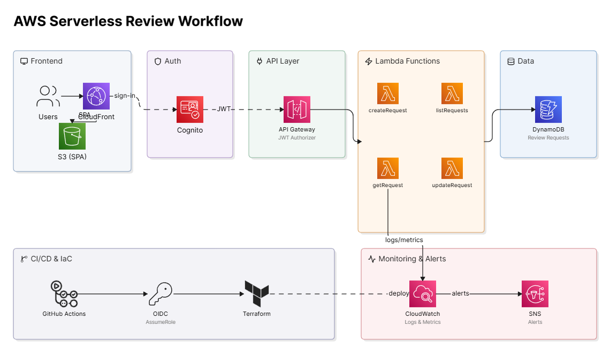
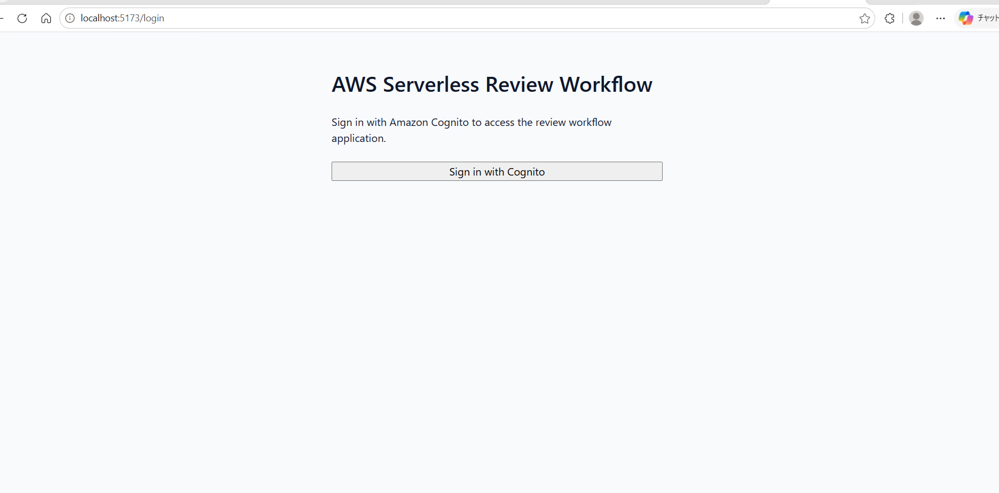
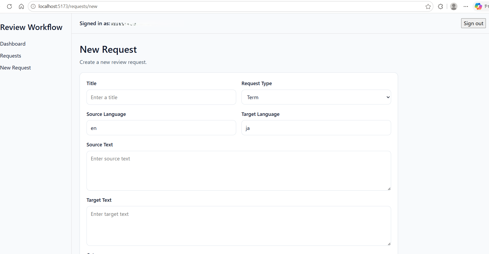
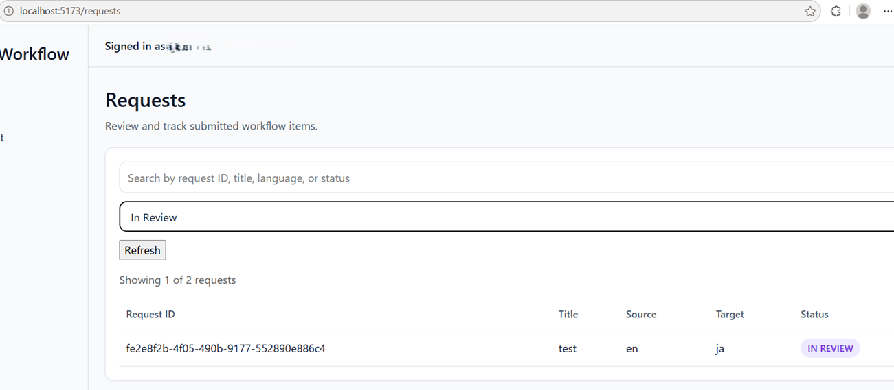
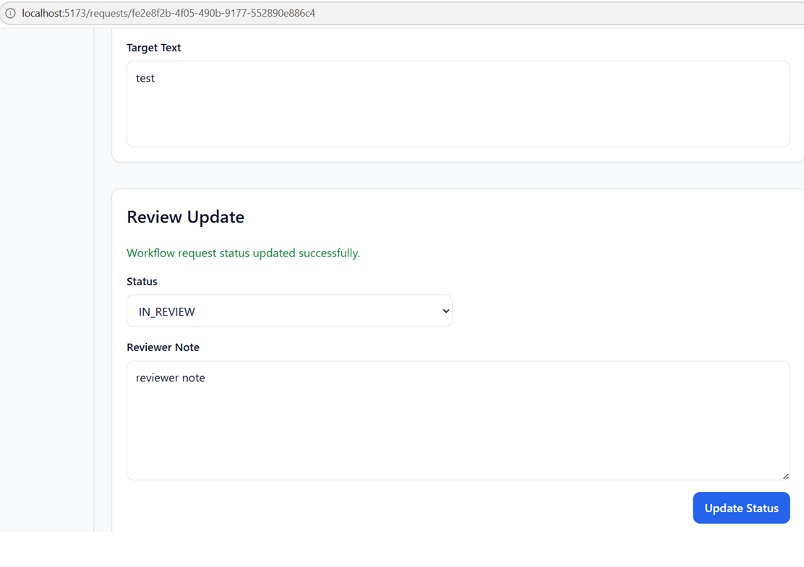

# AWS Serverless Review Workflow Platform

## Overview

This project is a serverless internal workflow application built on AWS for technical terminology and document review processes.

It uses Terraform, Amazon Cognito, API Gateway, AWS Lambda, DynamoDB, S3, CloudFront, CloudWatch, SNS, and GitHub Actions.

## Architecture

The application uses CloudFront and S3 for the frontend, Cognito for authentication, API Gateway and Lambda for backend processing, DynamoDB for data storage, and CloudWatch/SNS for monitoring and alerts.



## Scope

- User authentication with Amazon Cognito
- Protected API with a JWT authorizer
- Create and track review requests
- Update workflow status and reviewer notes
- Filter and search requests
- Basic monitoring and alerting
- CI validation and deployment workflow

## Tech Stack

- Terraform
- Amazon Cognito
- API Gateway HTTP API
- AWS Lambda
- DynamoDB
- S3
- CloudFront
- CloudWatch
- SNS
- GitHub Actions

## Repository Structure

```text
aws-serverless-review-workflow/
├─ app/
│  ├─ frontend/
│  └─ functions/
├─ infra/
│  ├─ modules/
│  └─ environments/
├─ docs/
│  ├─ architecture/
│  ├─ adr/
│  ├─ api/
│  ├─ runbooks/
│  └─ demo/
├─ tests/
├─ diagrams/
└─ .github/workflows/
```

## Local Development

For local setup, Terraform apply and destroy steps, frontend environment variables, and troubleshooting notes, see:

[docs/local-development.md](docs/local-development.md)

## Security Considerations

- JWT-protected API routes
- Least-privilege IAM design
- OIDC authentication from GitHub Actions to AWS
- No long-lived AWS credentials in source control
- Remote Terraform state with locking

## Cost Considerations

- Serverless-first design to keep idle cost low
- DynamoDB on-demand billing
- Static frontend delivery through S3 and CloudFront
- No always-on compute in the MVP
- Dev resources can be destroyed after validation

## Status

The core workflow is implemented in the dev environment.

**Implemented:**

- Cognito authentication with hosted UI login
- JWT-protected API routes
- Request list view
- Request creation flow
- Request detail view
- Request status and reviewer note updates
- Client-side request filtering and search
- Basic CloudWatch monitoring alarms
- Local development and troubleshooting documentation

**Planned follow-up improvements:**

- Dashboard summary
- Additional architecture and demo documentation
- CI/CD and deployment polish

## Roadmap

### Phase 1
- Repository bootstrap
- Project documentation
- API and architecture skeleton

### Phase 2
- Frontend scaffold
- Terraform root scaffold
- Module skeletons

### Phase 3
- Cognito
- DynamoDB
- Lambda base
- HTTP API with JWT authorizer

### Phase 4
- Request create/read/update workflow
- Dashboard
- Frontend integration

### Phase 5
- Monitoring and alerting
- GitHub Actions CI
- OIDC deployment flow

### Phase 6
- Runbooks
- ADRs
- Demo assets

## Screenshots

A short walkthrough of the main workflow.

### Sign in (Amazon Cognito)


### Create a review request


### Track and filter requests


### Update review status

