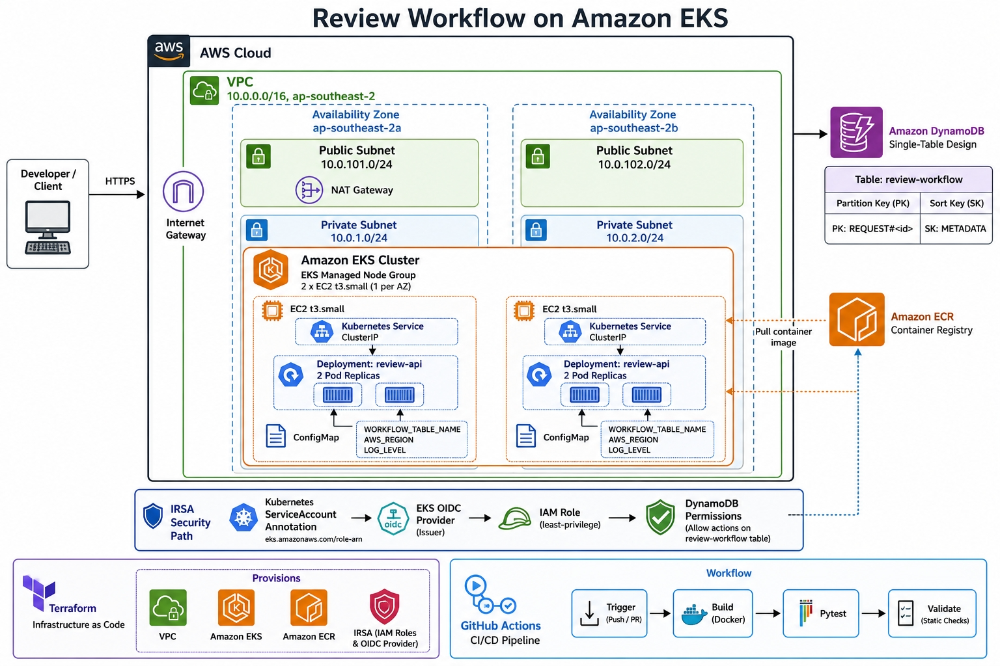
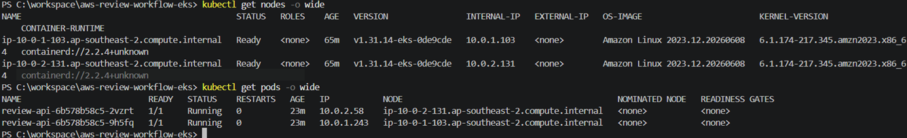
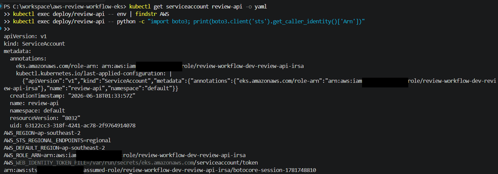
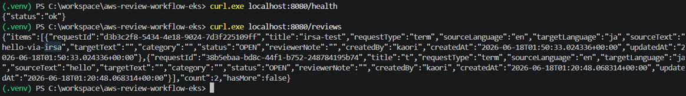

# Review Workflow on Amazon EKS

**Status:** Active. Runs locally via Docker Compose and has been deployed to a real EKS cluster for validation (see Demo below); not intended for production traffic as-is (see Known limitations).

An internal tool for reviewing technical terminology and documents. The API originally ran as AWS Lambda functions behind API Gateway; this repository moves that API onto a containerized service on Amazon EKS, while keeping the existing DynamoDB single-table model and business logic unchanged.

## What this project does

Anyone signed in can submit a terminology or document review request. It then moves through a workflow status (`OPEN`, `IN_REVIEW`, `APPROVED`, `REJECTED`) as members of the `reviewer` Cognito group approve or reject it. The domain logic was extracted from the original Lambda handlers into a transport-agnostic service layer (`app/api/service.py`) and is now exposed through FastAPI instead of API Gateway. The DynamoDB table, its `PK`/`SK` key schema, and the workflow logic itself are unchanged from the original implementation.

The original serverless stack (Cognito, API Gateway, Lambda, the React/Vite frontend) still lives in this repository, in `app/functions/` and `app/frontend/`, and is not removed by this migration. `docs/adr/0002-eks-migration-strategy.md` covers what moved and what stayed.

## Architecture

The API runs as a Deployment on EKS managed node groups, fronted by a ClusterIP Service, configured through a ConfigMap, and authenticated to DynamoDB through IRSA: a dedicated IAM role per Pod, assumed via the cluster's OIDC provider rather than the node's IAM role. Requests to the API itself are authenticated separately, by verifying a Cognito access token (see Security considerations). Infrastructure (VPC, EKS, ECR, IRSA) is provisioned with Terraform.



## Technology stack

- Python / FastAPI (containerized API)
- Docker (multi-stage build, non-root runtime user)
- Amazon EKS (managed node groups)
- Amazon ECR (image registry)
- Amazon Cognito (access token issuance, verified at the API)
- Amazon DynamoDB (single-table model, unchanged from the original design)
- Terraform (VPC, EKS, ECR, IRSA)
- Kustomize (base + EKS overlay)
- GitHub Actions (build and validation CI, plus documentation publishing — see Validation below)

## Repository structure

```text
aws-review-workflow-eks/
├─ app/
│  ├─ api/          # FastAPI service (containerized API)
│  ├─ functions/    # original Lambda handlers (migration source), plus the Cognito pre-token-generation trigger
│  └─ frontend/     # React/Vite frontend (Cognito Hosted UI login)
├─ k8s/
│  ├─ base/         # Deployment, Service, ConfigMap, ServiceAccount
│  └─ overlays/eks/ # ECR image reference + IRSA role-arn annotation
├─ infra/
│  ├─ modules/      # reusable Terraform modules
│  └─ environments/dev/  # EKS, ECR, IRSA, plus the original serverless resources
├─ scripts/         # local helpers (DynamoDB Local table creation)
├─ tests/           # service, API, and auth tests
├─ docs/
│  ├─ source/       # Sphinx documentation (tutorials, how-to, reference, explanation)
│  ├─ adr/          # architecture decision records
│  ├─ demo/eks/     # screenshots from a live EKS deployment
│  └─ diagrams/     # architecture diagrams
└─ .github/workflows/  # CI and documentation publishing
```

## Quick start

Run the API and DynamoDB Local with Docker Compose:

```bash
docker compose up --build -d
python scripts/create_local_table.py
curl localhost:8080/health
curl localhost:8080/reviews
docker compose down
```

Local development runs with `AUTH_MODE=none`, so no token is needed for these commands. On EKS, every route except `/health` requires a valid Cognito access token in the `Authorization` header.

Run the tests:

```bash
pip install -r requirements-dev.txt
pytest -q
```

Deploying to EKS, rolling back a version, or debugging a failing Pod involves more than fits here; see the guides linked below.

## Documentation

Full documentation — tutorials, how-to guides, reference, and the reasoning behind the EKS migration — is published from this repository with Sphinx: **[review-workflow-eks docs](https://kaorikunimasu.github.io/aws-review-workflow-eks/)**.

- [Run the service locally](docs/source/tutorials/run-the-service-locally.rst)
- [Deploy an application version](docs/source/how-to/deploy-an-application-version.rst)
- [Roll back a deployment](docs/source/how-to/roll-back-an-application-deployment.rst)
- [Migrating from Lambda to EKS](docs/source/explanation/migrating-from-lambda-to-eks.rst)

## Demo

Nodes and Pods running on the provisioned EKS cluster:



IRSA verified from inside the Pod: the ServiceAccount's role-arn annotation and the actual STS identity the container assumes (account ID redacted).



Health check and a live `/reviews` call against the Pod through a port-forward:



## Validation performed

- Local: Docker Compose against DynamoDB Local, and a local Kubernetes cluster (`kind`).
- Live: deployed to a real EKS cluster provisioned by the Terraform in this repository. IRSA identity, health checks, and API calls were all verified against that deployment (see Demo above).
- Reviewer-group authorization was checked against a real Cognito user pool: created a reviewer and a non-reviewer test account, confirmed the `groups` claim on each access token, and confirmed `PATCH /reviews/{id}/status` returns `403` for the non-reviewer and passes auth for the reviewer. Resources were torn down afterward.
- CI (`.github/workflows/ci.yml`, `.github/workflows/docs.yml`): runs `pytest` (including Cognito token verification tests), a Docker build, `terraform fmt`/`validate`, a `kustomize build` of the EKS overlay, and a Sphinx documentation build and publish on every pull request. CI does not apply Terraform, push images, or apply Kubernetes manifests; those steps are manual and documented in the how-to guides above.

## Security considerations

- **Authentication is enforced.** Every route except `/health` requires a valid Cognito access token in the `Authorization: Bearer <token>` header. The API verifies the token's signature against Cognito's published JWKS, checks the issuer and expiry, and confirms it was issued for this app client (`app/api/auth.py`). A request with no token, an expired token, or a token from a different Cognito app client is rejected with `401` before it reaches any business logic.
- **Approving or rejecting a request requires the `reviewer` Cognito group.** Submitting a request, listing the queue, and reading a single request only require authentication — this is a shared review queue, not a private inbox, so any signed-in account can see what's in it. But changing a request's status (`PATCH /reviews/{id}/status`) additionally requires group membership, checked in `app/api/deps.py:require_reviewer`. Without this, anyone with an account (self-service sign-up is on) could approve their own submission. The group membership itself travels on the Cognito access token via a Pre Token Generation trigger (`app/functions/pre_token_generation`), since access tokens don't carry group claims by default. See `docs/adr/0005-reviewer-group-authorization.md` for the reasoning and what's deliberately still open (e.g. reviewers can approve their own submissions; there's no bootstrap flow for the first reviewer, group membership is granted manually).
- **DynamoDB access is scoped independently.** The Pod authenticates to DynamoDB through IRSA, not the node's IAM role, and the attached policy only grants `GetItem`/`Query`/`Scan`/`PutItem`/`UpdateItem` on this table. This layer was already correctly scoped before the authentication work above; the two are unrelated mechanisms and were verified separately.
- Local development runs with `AUTH_MODE=none`: a fixed placeholder identity, no header, no token, nothing to configure. This only applies to `docker compose`; the Kubernetes ConfigMap for EKS sets `AUTH_MODE=cognito`, and the API refuses to start under that mode without `COGNITO_USER_POOL_ID` and `COGNITO_CLIENT_ID` configured.
- No long-lived AWS credentials are stored in this repository. The container runs as a non-root user.

## Cost considerations

EKS is not serverless: the control plane, the node group, and the NAT gateway all run continuously regardless of traffic, unlike the original Lambda-based deployment's per-invocation billing. The dev environment here is provisioned with Terraform and torn down (`terraform destroy`) after each round of validation specifically to avoid an ongoing bill. `docs/source/explanation/serverless-and-kubernetes-trade-offs.rst` covers where that trade-off does and doesn't pay off.

## Known limitations

- Reads (list/detail) and submitting a request have no owner scoping: any authenticated account can see and create requests in the shared queue. Only status changes are gated by reviewer group membership (see Security considerations above).
- The frontend doesn't hide the approve/reject controls from non-reviewers; a non-reviewer sees them and gets a `403` on click. Enforcement is correct either way, this is a UX gap, not a security one.
- No bootstrap path into the `reviewer` group — the first (and every) reviewer has to be added manually via the Cognito console or CLI.
- The Service is `ClusterIP` only. There's no Ingress or LoadBalancer, so nothing is reachable from outside the cluster without a `kubectl port-forward`.
- No remote Terraform backend is configured; state is local unless someone sets one up.
- The EKS Terraform module is pinned to the v20.x line to avoid an AWS provider major-version upgrade across the whole stack, including the untouched serverless resources (`docs/adr/0004-terraform-version-constraints-and-ci.md`).
- A single NAT gateway is used to control dev cost. It's a single point of failure, not a highly-available configuration (`docs/adr/0003-eks-cluster-topology.md`).